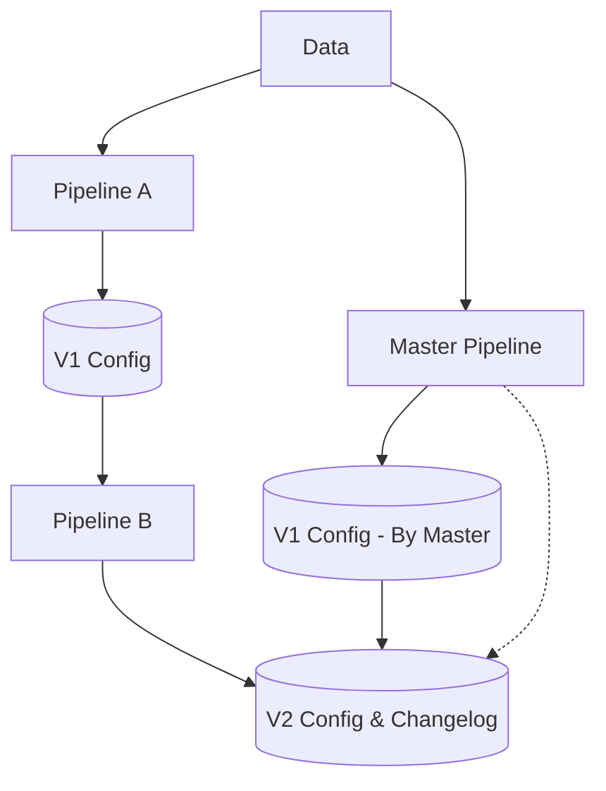
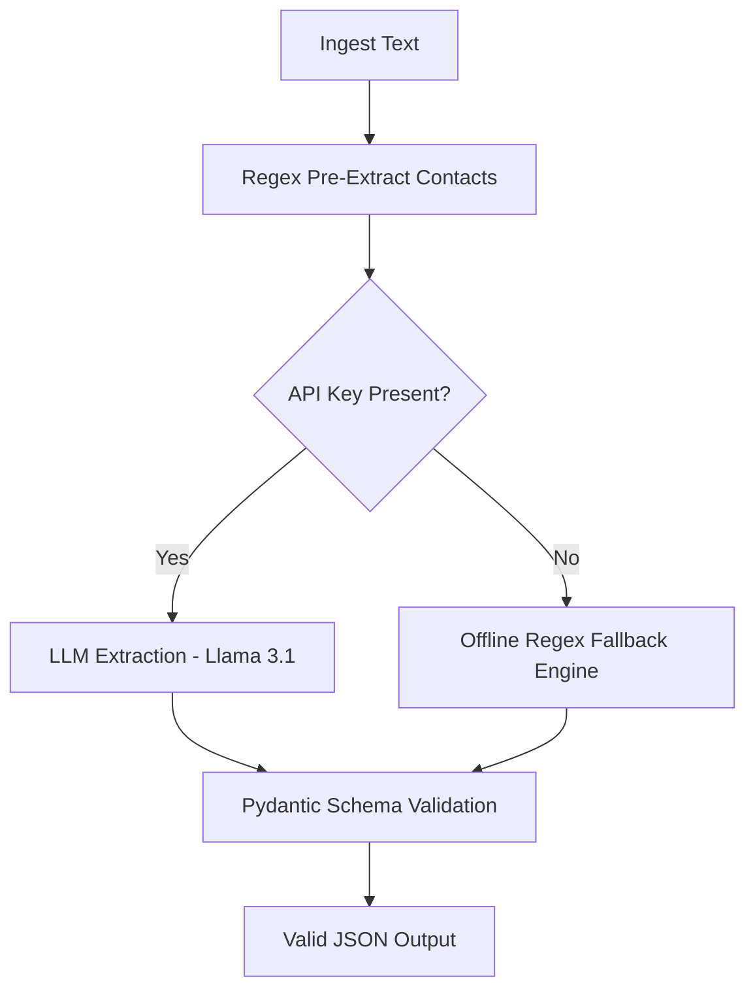

<div align="center">
  
  # 🤖 Clara-AI Automation Pipeline
  
  **Intelligent Multi-Phase Agent Orchestration & Extraction System**

  <p align="center">
    <strong>Semantic Extraction • Regex Fallback • Master Orchestration</strong>
  </p>

  <p align="center">
    
    
    
    
  </p>
</div>

---
## 📘 Table of Contents

- [Overview](#-overview)
- [Key Features](#-key-features)
- [Architecture](#-architecture)
- [Architecture Diagrams](#-architecture-diagrams)
- [Getting Started](#-getting-started)
- [Execution Commands](#-execution-commands)
- [Optional Features](#-optional-features)
- [Contributor & Creator](#-contributor-and-creator)

---

## 📖 Overview

**Clara-AI** is a high-performance automation pipeline engineered to transform unstructured client data (transcripts, chat logs, and voice notes) into strictly structured AI configurations. Originally developed as a specialized technical assignment, the project has evolved into a robust **Minimum Viable Product (MVP)** capable of handling complex onboarding workflows and semantic extraction entirely autonomously.

The system features a dual-phase architecture:
- **Pipeline A (Demo Phase)**: Extracts baseline intent from raw demo calls.
- **Pipeline B (Onboarding Phase)**: Dynamically merges follow-up updates into existing configurations.
- **Master Orchestrator**: Synchronizes both phases into a unified, traceable execution loop with deep-diff changelogs.

---

## ✨ Key Features

### 🔧 Intelligent Extraction Engine

- Highly structured Pydantic schemas enforce robust JSON generation.
- Zero-Hallucination rules: If data is missing from text, it is set to "Unknown".
- Verified Contact Injection via Regex mapping to guarantee clean phone numbers and emails.

### 🧰 Rule-Based Fallback System

- Automatically handles data extraction via tight Regex sequences if an API key is missing.
- Accurately identifies 15+ complex trade services, phrase-based routing networks, and isolated CRMs locally and entirely offline.

### ⏸ Modularity & Traceability

- Pipeline components can be run explicitly by target `account_id` or auto-incremented dynamically.
- `DeepDiff` engine generates robust precise changelogs highlighting specifically what the AI logic loop updated.

---

## 🧱 Architecture

The project has been uniquely organized for maximum cleanliness. Unused caches, IDE configs, virtual environments, and structural artifacts are intentionally ignored or hidden.

```text
Clara-AI/
│
├── data/                                 # Raw input data for the pipeline
│   ├── Clara-demo-for-Bens-electrical-solutions-team-mp4-86f5e3d8-a55c.json
│   ├── Copy of audio1975518882.m4a
│   └── Copy of chat.txt
│
├── outputs/                              # Auto-generated processing artifacts
│   └── accounts/
│       ├── account-[ID]/                 # Configs isolated by target ID
│       │   ├── v1/
│       │   │   ├── account_memo.json
│       │   │   └── agent_spec.json
│       │   └── v2/
│       │       ├── account_memo.json
│       │       ├── agent_spec.json
│       │       └── changelog.json
│
├── scripts/                              # Core Python execution logic
│   ├── pipeline_a_demo.py                # Demo extraction (Phase A)
│   ├── pipeline_b_onboarding.py          # Onboarding modification (Phase B)
│   ├── pipeline_master.py                # Autonomous Master Orchestrator
│   ├── pipeline_utils.py                 # Core Schema & Extraction logic
│   └── transcribe_audio.py               # Optional offline Whisper script
│
├── requirements.txt                      # Project dependency locking
├── .env                                  # (Optional) Environment keys
└── video_presentation_script.md          # Director's pipeline walk-through
```

---

## 🧩 Architecture Diagrams

### **High-Level System Diagram**



---

### **Extraction Logic Flow**



---

## 🚀 Getting Started

### 1️⃣ Installation

```bash
git clone https://github.com/dheerajpapani/Clara-AI.git
cd Clara-AI
python -m venv .venv
# Activate: windows: .venv\Scripts\activate | linux: source .venv/bin/activate
pip install -r requirements.txt
```

### 2️⃣ API Setup (Optional)
Create a `.env` file in the root directory:
```text
GROQ_API_KEY=your_key_here
```
*Note: If no API key is present, the system automatically engages the **Local Regex Fallback Engine** for data extraction.*

---

## 📡 Execution Commands

### ▶ Master Orchestrator (End-to-End)

The master pipeline autonomously runs Phase A and Phase B concurrently across unified data sources.

**Without Explicit ID (Auto-Increments to `account-1`, `account-2`...):**

```powershell
python scripts/pipeline_master.py --demo_json "data/Clara-demo-for-Bens-electrical-solutions-team-mp4-86f5e3d8-a55c.json" --onboarding_text "data/Copy of chat.txt"
```

### ▶ Pipeline A (Demo Extraction Phase)

**With Explicit ID:**

```powershell
python scripts/pipeline_a_demo.py --input "data/Clara-demo-for-Bens-electrical-solutions-team-mp4-86f5e3d8-a55c.json" --account_id "bens_electrical"
```

**Without Explicit ID:**

```powershell
python scripts/pipeline_a_demo.py --input "data/Clara-demo-for-Bens-electrical-solutions-team-mp4-86f5e3d8-a55c.json"
```

### ▶ Pipeline B (Onboarding Modification Phase)

**With Explicit ID:**

```powershell
python scripts/pipeline_b_onboarding.py --input "data/Copy of chat.txt" --account_id "bens_electrical"
```

**Without Explicit ID:**
_(Automatically connects backwards to modify the most recently generated account folder directly)_

```powershell
python scripts/pipeline_b_onboarding.py --input "data/Copy of chat.txt"
```

---

## 🎤 Optional Features

### ▶ Offline Audio Transcription

This repository comes packed with an optional lightweight, offline `Whisper-v3` transcriber to turn raw media files sequentially into clean texts:

```powershell
python scripts/transcribe_audio.py --audio "data/Copy of audio1975518882.m4a" --output "data/onboarding_transcript.txt"
```

---

## 👤 Contributor and Creator

Developed and Maintained by **Dheeraj Papani**.

<a href="https://github.com/dheerajpapani">
  
</a>
<a href="https://www.linkedin.com/in/dheerajpapani">
  
</a>
